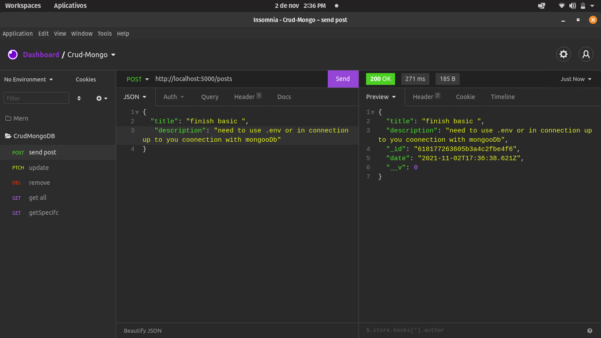

  

Use PostMan or Insonia: 

Crud Simples Api rest full

  <a href="#-projeto">Projeto</a>&nbsp;&nbsp;&nbsp;|&nbsp;&nbsp;&nbsp;
   <a href="#-Tecnologias">Tecnologias</a>

 

  

 

## 🚀 Tecnologias

Esse projeto foi desenvolvido com as seguintes tecnologias:

- java script [ecma6]
- Mongo Db
- NodeJS

## :memo: Licença
MIT

